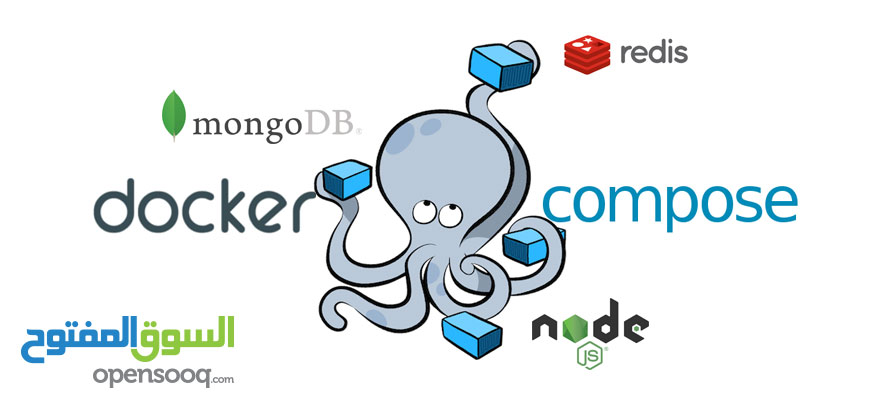
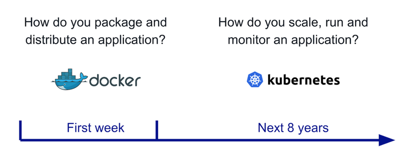

# Chap 1: Docker
* Docker là cái vẹo gì? => la nền tảng để cung cấp cách để building, deploying và running ứng dụng dễ dàng hơn bằng cách sử dụng các containers.
    ## Một số định nghĩa trong Docker
        1. Container: Khi đóng gói một ứng dụng & tất cả các thành phần cần thiết (như một số thư viện) tạo thành 1 gói (package) thì gọi là Container.
        2. Images: là template để tạo ra các container. vd: thường triển khai website lên linux & nginx (hoặc apache) thì có thể xây dựng dựa trên 1 image CentOS & nginx có sẵn để chạy.
        3. Dockerfile: là một file kịch bản dựa vào file kịch bản này Docker sẽ dựa theo để build ra 1 image.
        4. Volumes: là phần dữ liệu được tạo ra khi container được khởi tạo.
    ## Docker architecture
    
    ## Docker compose
    * Docker compose là công cụ để định nghĩa và run milti-container cho Docker. Ví dụ: nếu bạn có 3 image: BE, FE & DB được đóng gói thành 3 image thì lúc này cần 1 công cụ để có thể chạy 3 image này & 1 số setting khác...
    
    ## Docker basic command
        1. Command build image: docker build -t {name_image} .
        2. Command run image: docker run -d -p {port binding - 5000:80} -- name {name_container} {name_image}
        3. Run Compose: docker-compose up
        4. Build Compose: docker-compose build
        5. Scale Compose: docker-compose scale <tên service> = <số lượng>
    ## Docker Swarm va Kubernetes (k8s)
    * Khi nói về Docker không thể không đề cập tới **container** đầu tiên như tiêu chuẩn mở để đóng gói & phân phối các ứng dụng container thì đã nãy sinh ra một vấn đề mới. Làm thế nào để tất cả containers được điều phối và lên lịch? làm thể nào để nâng cấp một cách liền mạch mà không bị gián đoạn dịch vụ? Làm cách nào để tracking status của ứng dụng, biết khi nào có sự cố và khởi động lại ứng dụng đó một cách kịp thời?  
            
    * Lúc này hệ thống điều phối là cần thiết.
       * Docker Swarm: cung cấp cách quản lý một số lượng lớn các container trải rộng trên các cụm máy chủ do Docker tao ra.
       * Kubernetes: là bộ điều phối container được phát triển tại Google, đã được tài trợ cho CNCF và hiện là mã nguồn mở.
    * **Tổng kết:** Kubernetes là một hệ thống toàn diện để tự động hóa việc triển khai, lập lịch và mở rộng quy mô của các ứng dụng được container hóa. Hiện tại, Kubernetes là công ty dẫn đầu thị trường và là tiêu chuẩn cho các bộ điều phối container và deploy các ứng dụng phân tán. Kubernetes có thể chạy được trên các dịch vụ đám mây hoặc tại chỗ (on-premise), có tính mô-đun cao, mã nguồn mở và có một cộng đồng sôi động.
  
