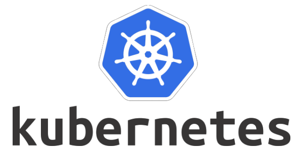
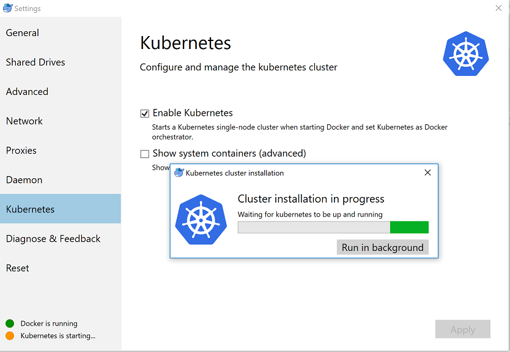
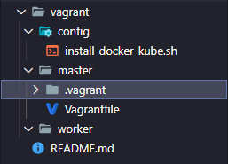

# Chap 3: Kubernetes
  
 * Là một hệ thống để chạy, quản lý & điều phối các ứng dụng được container hóa trên 1 cụm máy(1 hoặc nhiều máy) gọi là **Cluster**. 
  
  ## Một số khái niệm cơ bản
  1. Master Server: (thằng này kiểu chủ tịch huyện quản lý nhiều thôn xã) là đầu nảo quản lý & điều khiển cả cụm server. Các thành phần trong master server:
       1. etct: lưu trữ cấu hình chung cho cả cụm server, etct được đặt tại master server. etct là **opensource** cung cấp dịch vụ dưới dạng key-value.
       2. kube-apiserver: cung cấp các api dưới dạng restful để các client tương tác được với các Kubernetes.
       3. kube-scheduler: giúp lựa chon Node nào để chạy các ứng dụng căn cứ vào tài nguyên & yếu tố khác để giúp hệ thống chạy ổn định.
       4. kube-controller: điều khiển trang thái của cluster, thực hiện các tác vụ thêm xóa sửa ... các tài nguyên.
  2. kubelet: (thằng này kiểu chủ tịch xã) dịch vụ chạy trên tất cả các Node, giám sát chạy, dừng, duy trì các ứng dụng chạy trên node của nó.
  3. kube-proxy: cung cấp mạng proxy để các ứng dụng từ ngoài gọi vào cluster.
  4. Pod: chứa một hoặc nhiều container, volume và nằm trong **Node**.
   
   
  

  ## Kubernetes cluster

   ---
   **K8s architecture**

    
   

   ### Kích hoạt Kubernetes (hơi lâu tẹo @_@)
    

   ### Tạo Cluster Kubernetes
   * Phần này sẽ tạo ra một Cluster K8s hoàn chỉnh từ 3 servers chạy CentOS. Thông tin như sau:  
   
| Tên máy/Hostname | Thông tin hệ thống                                           | Vai trò             |
| ---------------- | ------------------------------------------------------------ | ------------------- |
| master.xtl       | HĐH CentOS7, Docker CE, Kubernetes. Địa chỉ IP 172.16.10.100 | Khởi tạo là master  |
| worker1.xtl      | HĐH CentOS7, Docker CE, Kubernetes. Địa chỉ IP 172.16.10.101 | Khởi tạo là worker1 |
| worker2.xtl      | HĐH CentOS7, Docker CE, Kubernetes. Địa chỉ IP 172.16.10.102 | Khởi tạo là worker2 |
   

  * **Baby Let's go:**
    1. Chúng ta sẽ tạo 1 workspace để quản lý source code cho dễ nha, ở đây mình dùng **Visual studio code** khá chất lượng. 
    2. Tạo thư mục vagrant để quản lý các file cấu hình(vagrantfile).
    3. cấu trúc thư mục mình sẽ tạo như sau (*theo sở thích là gọn chứ không cần phải follow theo* :laughing:) : 

           
       1. Tạo folder **master** chứa cấu hình của master server.
       2. Folder config chứa action script (`khi setup 1 server cần cài đặt & bật 1 số tính năng như ssh, cài docker, tắt firewall,... `).
       3. Folder **woker** chứa cấu hình của woker node.
  
