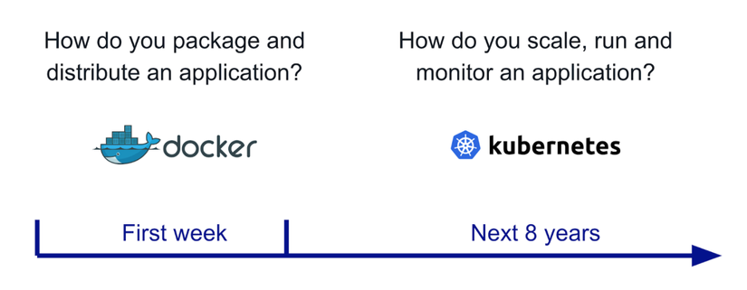

# Chap 1: Docker
* Docker là cái vẹo gì? => la nền tảng để cung cấp cách để building, deploying và running ứng dụng dễ dàng hơn bằng cách sử dụng các containers.
    ## Một số định nghĩa trong Docker
        1. Container: Khi đóng gói một ứng dụng & tất cả các thành phần cần thiết (như một số thư viện) tạo thành 1 gói (package) thì gọi là Container.
        2. Images: là template để tạo ra các container. vd: thường triển khai website lên linux & nginx (hoặc apache) thì có thể xây dựng dựa trên 1 image CentOS & nginx có sẵn để chạy.
        3. Dockerfile: là một file kịch bản dựa vào file kịch bản này Docker sẽ dựa theo để build ra 1 image.
        4. Volumes: là phần dữ liệu được tạo ra khi container được khởi tạo.
    ## Docker architecture
    
    ## Docker basic command
        1. Command build image: docker build -t {name_image} .
        2. Command run image: docker run -d -p {port binding - 5000:80} -- name {name_container} {name_image}
    ## Docker Swarm va Kubernetes (k8s)
    * Khi nói về Docker không thể không đề cập tới **container** đầu tiên như tiêu chuẩn mở để đóng gói & phân phối các ứng dụng container thì đã nãy sinh ra một vấn đề mới. Làm thế nào để tất cả containers được điều phối và lên lịch? làm thể nào để nâng cấp một cách liền mạch mà không bị gián đoạn dịch vụ? Làm cách nào để tracking status của ứng dụng, biết khi nào có sự cố và khởi động lại ứng dụng đó một cách kịp thời?  
            
    * Lúc này hệ thống điều phối là cần thiết.
       * Docker Swarm: cung cấp cách quản lý một số lượng lớn các container trải rộng trên các cụm máy chủ do Docker tao ra.
       * Kubernetes: là bộ điều phối container được phát triển tại Google, đã được tài trợ cho CNCF và hiện là mã nguồn mở.
    * **Tổng kết:** Kubernetes là một hệ thống toàn diện để tự động hóa việc triển khai, lập lịch và mở rộng quy mô của các ứng dụng được container hóa. Hiện tại, Kubernetes là công ty dẫn đầu thị trường và là tiêu chuẩn cho các bộ điều phối container và deploy các ứng dụng phân tán. Kubernetes có thể chạy được trên các dịch vụ đám mây hoặc tại chỗ (on-premise), có tính mô-đun cao, mã nguồn mở và có một cộng đồng sôi động.
# Chap 2: Vagrant
 
* Vagrant là một công cụ tương tác với các nền tảng ảo hóa như VirtualBox, HyperV, VM ..., nó giúp tạo và quản lý các máy ảo trên các nền tảng đó. Vagrant cung cấp một cấu hình đơn giản tạo và quản lý, tương tác với máy ảo mà không có nhiều sự khác biệt dù bạn đang sử dụng VirtualBox, VM hay HyperV.

  ## Lưu ý trước khi cài đặt
  * Một số máy ảo của google, AWS, VNG hiện mặc định không mở tính năng ảo hóa hỗ trợ công nghệ **Virtualization**. Nên trước khi thiết lập nên kiểm tra xem có hỗ trợ công nghệ Virtualization không nhé. Có 2 loại là **VT-X(Chip intel) & AMD-V(Chip AMD)**.
  * Windows:    
  * Linux: **lscpu**   
  

  ## Let's Go
  * Để ảo hóa chúng ta sẽ cài **virtualbox** để tạo ra máy ảo & cài đặt vargant nha.
    
    ### Cài đặt VirtualBox
      1.  sudo yum -y update
      2.  sudo yum –y install epel-release
      3.  sudo yum –y install gcc dkms make qt libgomp patch
      4.  sudo yum –y install kernel-headers kernel-devel binutils glibc-headers glibc-devel font-forge
      5.  sudo yum -y install wget
      6.  wget https://www.virtualbox.org/download/oracle_vbox.asc
      7.  rpm --import oracle_vbox.asc
      8.  mkdir /etc/yum.repo.d/
      9.  cd /etc/yum.repo.d/      
      10. wget http://download.virtualbox.org/virtualbox/rpm/el/virtualbox.repo -O /etc/yum.repos.d/virtualbox.repo      11. 
      12. yum install -y VirtualBox-6.0
      13. systemctl status vboxdrv #check status
  
    ### Cài đặt Vagrant
      1. sudo yum -y update
      2. sudo yum -y install https://releases.hashicorp.com/vagrant/2.2.6/vagrant_2.2.6_x86_64.rpm
      3. vagrant --version # Check Version
    

  ## Vagrant Cơ bản
      1. mkdir /var/vagrant/ #Tạo 1 thư mục chứa project
      2. cd /var/vagrant/ 
      3. vagrant init # Khởi tạo file Vagrantfile
      4. vagrant plugin install vagrant-vbguest
      5. yum -y install rsync
      6. Thiết Vagrantfile như sau: 
   
                # -*- mode: ruby -*-
                # vi: set ft=ruby :

                Vagrant.configure(2) do |config|                # Bắt đầu khai báo máy ảo
                  config.vm.box = 'centos/7'                    # Sử dụng Box centos/7 tạo máy ảo

                  config.vm.provider "virtualbox" do |vb|       # Máy ảo dùng nền tảng virtualbox, với các cấu hình bổ sung thêm cho provider
                    vb.name = "may-ao-01"                      # đặt tên máy ảo tạo ra
                    vb.cpus = 2                                # cấp 2 nhân CPU
                    vb.memory = "2048"                         # cấu hình dùng 2GB bộ nhớ
                  end                                           # hết cấu hình provider

                end                                             #  hết cấu hình tạo máy ảo
      7. vagrant up # Khởi tạo máy ảo dựa trên file **Vagrantfile**
      8. Khi máy ảo đang chạy, vẫn đang ở dòng lệnh tại thư mục chứa file Vagrant để kết nối đến máy ảo bằng giao thức ssh gõ lệnh sau:
         1. vagrant ssh # ssh -> logout: exit
         2. sudo -i #Bạn sẽ đăng nhập vào máy ảo với tài khoản user có tên là vagrant, từ tài khoản này nếu muốn chuyển sang root

    ### Lệnh vagrant hay dùng
    | Lệnh            | Thông tin                                                    |
    | --------------- | ------------------------------------------------------------ |
    | vagrant init    | Sinh file cấu hình máy ảo mới Vagrantfile                    |
    | vagrant up      | Thực hiện tạo / hoặc chạy máy ảo với cấu hình từ Vagrantfile |
    | vagrant ssh     | Kết nối ssh vào máy ảo, tài khoản kết nối là vagrant         |
    | vagrant halt    | Dừng máy ảo (shutdown)                                       |
    | vagrant reload  | Khởi động lại máy ảo, có đọc lại cấu hình trong Vagrantfile  |
    | vagrant destroy | Xóa máy ảo                                                   |
    

  ## Vagrant Nâng cao

    ### Đồng bộ thư mục
    * Mặc định khi chạy máy ảo, nó đã đồng bộ qua lại giữa thư mục chứa file Vagrantfile vào thư mục /vagrant/ của máy ảo. Nếu muốn cấu hình đồng bộ sử dụng config.vm.synced_folder, ví dụ cần đồng bộ thư mục máy host hiện tại . vào thư mục /data/mydata/ của máy ảo.  
  
          config.vm.synced_folder '.',  '/data/mydata/'
    * sửa lại Vagrantfile như sau:
  
                # -*- mode: ruby -*-
                # vi: set ft=ruby :

                Vagrant.configure(2) do |config|                # Bắt đầu khai báo máy ảo
                  config.vm.box = 'centos/7'                    # Sử dụng Box centos/7 tạo máy ảo

                  config.vm.synced_folder '/var/vagrant/hehe/', '/var/vagrant/'    # Chia sẻ thư mục máy host và máy ảo

                  config.vm.provider "virtualbox" do |vb|       # Máy ảo dùng nền tảng virtualbox, với các cấu hình bổ sung thêm cho provider
                    vb.name = "may-ao-01"                      # đặt tên máy ảo tạo ra
                    vb.cpus = 2                                # cấp 2 nhân CPU
                    vb.memory = "2048"                         # cấu hình dùng 2GB bộ nhớ
                  end                                           # hết cấu hình provider

                end                                             #  hết cấu hình tạo máy ảo
    * Chạy lệnh **vagrant reload** để nạp lại cấu hình máy ảo

    ### Forward cổng máy ảo ra host
    * Nếu muốn chuyển cổng từ máy ảo ra máy host, ví dụ cổng máy ảo là 80 ra cổng máy host 8080 (có nghĩa là từ máy host truy cập cổng 8080 - locahost:8080 - thì có nghĩa là truy cập cổng 80 của máy ảo).
  
            config.vm.network "forwarded_port", guest: 80, host: 8080
    * Ngoài ra bạn cũng có thể thiết lập cho máy ảo có cấu hình với địa chỉ IP do bạn chỉ định và NAT giúp máy host (các máy khác trong LAN) truy cập đến địa chỉ này của máy ảo mà không cần forward cổng.

            config.vm.network "private_network", ip: "192.168.10.155"
    * Với cấu hình trên, thì địa chỉ máy ảo là 192.168.10.155, bạn có thể truy cập đến các cổng của máy ảo với địa chỉ IP này, ví dụ http://192.168.10.155 (tức cổng 80).

    ### Provision - chạy lệnh khi tạo máy ảo

    * Trong quá trình tạo máy ảo, sau khi nạp Box, bạn có thể chạy các lệnh, các script của hệ điều hành, nếu chạy một script từ file myscript.sh thì cấu hình là:

          config.vm.provision "shell", path: "./myscript.sh"

    * Vagrantfile (Ví dụ sau tạo máy ảo CentOS, cài Apache, PHP)

                # -*- mode: ruby -*-
                # vi: set ft=ruby :

                Vagrant.configure(2) do |config|                # Bắt đầu khai báo máy ảo
                  config.vm.box = 'centos/7'                    # Sử dụng Box centos/7 tạo máy ảo

                  config.vm.network "private_network", ip: "192.168.10.55"   # Lập IP cho máy ảo
                  config.vm.hostname = "master.xtl"             # Đặt hostname cho máy ảo

                  config.vm.synced_folder '.', '/var/www/public/' # Chia sẻ thư mục máy host và máy ảo

                  config.vm.provider "virtualbox" do |vb|       # Máy ảo dùng nền tảng virtualbox, với các cấu hình bổ sung thêm cho provider
                    vb.name = "may-ao-01"                      # đặt tên máy ảo tạo ra
                    vb.cpus = 2                                # cấp 2 nhân CPU
                    vb.memory = "2048"                         # cấu hình dùng 2GB bộ nhớ
                  end                                           # hết cấu hình provider

                # Chạy các lệnh cài đặt
                config.vm.provision "shell", inline: <<-SHELL
                    # cài đặt Apache, PHP
                    yum update -y
                    yum install httpd php -y
                    systemctl start httpd
                    systemctl enable httpd

                    # Tat SELinux cua CentOS
                    setenforce 0
                    sed -i --follow-symlinks 's/^SELINUX=enforcing/SELINUX=disabled/' /etc/sysconfig/selinux

                    # Đổi root password thành 123 và cho phép login SSH qua root
                    echo "123" | passwd --stdin root
                    sed -i 's/^PasswordAuthentication no/PasswordAuthentication yes/' /etc/ssh/sshd_config
                    systemctl reload sshd

                    # Tạo file cấu hình vhost lưu vào /etc/httpd/conf.d/vhost.conf để Apache nạp
                    echo '<VirtualHost *:80>
                      DocumentRoot /var/www/public
                      AllowEncodedSlashes On

                      <Directory /var/www/public>
                        Options +Indexes +FollowSymLinks
                        DirectoryIndex index.php index.html
                        Order allow,deny
                        Allow from all
                        AllowOverride All
                        </Directory>
                    </VirtualHost>' > /etc/httpd/conf.d/vhost.conf
                    systemctl start httpd
                SHELL
                end  

     * Lưu ý: **Không nên comment tiếng việt, sẽ dẫn đến lỗi.**