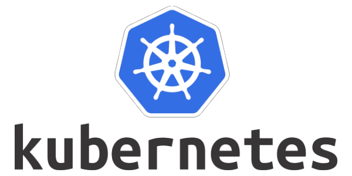

# Chap 3: Kubernetes
  
 * Là một hệ thống để chạy, quản lý & điều phối các ứng dụng được container hóa trên 1 cụm máy(1 hoặc nhiều máy) gọi là **Cluster**. 
  
  ## Một số khái niệm cơ bản
  1. Master Server: (thằng này kiểu chủ tịch huyện quản lý nhiều thôn xã) là đầu nảo quản lý & điều khiển cả cụm server. Các thành phần trong master server:
       1. etct: lưu trữ cấu hình chung cho cả cụm server, etct được đặt tại master server. etct là **opensource** cung cấp dịch vụ dưới dạng key-value.
       2. kube-apiserver: cung cấp các api dưới dạng restful để các client tương tác được với các Kubernetes.
       3. kube-scheduler: giúp lựa chon Node nào để chạy các ứng dụng căn cứ vào tài nguyên & yếu tố khác để giúp hệ thống chạy ổn định.
       4. kube-controller: điều khiển trang thái của cluster, thực hiện các tác vụ thêm xóa sửa ... các tài nguyên.
  2. kubelet: (thằng này kiểu chủ tịch xã) dịch vụ chạy trên tất cả các Node, giám sát chạy, dừng, duy trì các ứng dụng chạy trên node của nó.
  3. kube-proxy: cung cấp mạng proxy để các ứng dụng từ ngoài gọi vào cluster.
  4. Volumes: nằm trong pod. Dùng để lưu trữ dữ liệu của Pod. Volumes được định nghĩa trong trong cấu hình file *yaml* khi khởi tạo các pods.
  5. Pod: chứa một hoặc nhiều container, volume và nằm trong **Node**.
   
   
  

  ## Kubernetes cluster

   ---
   **K8s architecture**

    
   

   ### Kích hoạt Kubernetes (hơi lâu tẹo @_@)
    

   ### Tạo Cluster Kubernetes
   * Phần này sẽ tạo ra một Cluster K8s hoàn chỉnh từ 3 servers chạy CentOS. Thông tin như sau:  
   
| Tên máy/Hostname | Thông tin hệ thống                                           | Vai trò             |
| ---------------- | ------------------------------------------------------------ | ------------------- |
| master.xtl       | HĐH CentOS7, Docker CE, Kubernetes. Địa chỉ IP 172.16.10.100 | Khởi tạo là master  |
| worker1.xtl      | HĐH CentOS7, Docker CE, Kubernetes. Địa chỉ IP 172.16.10.101 | Khởi tạo là worker1 |
| worker2.xtl      | HĐH CentOS7, Docker CE, Kubernetes. Địa chỉ IP 172.16.10.102 | Khởi tạo là worker2 |
   

  * **Baby Let's go:**
    1. Chúng ta sẽ tạo 1 workspace để quản lý source code cho dễ nha, ở đây mình dùng **Visual studio code** khá chất lượng. 
    2. Tạo thư mục vagrant để quản lý các file cấu hình(vagrantfile).
    3. cấu trúc thư mục mình sẽ tạo như sau (*theo sở thích là gọn chứ không cần phải follow theo* :laughing:) : 

           
       1. Tạo folder **master** chứa cấu hình của master server.
       2. Folder config chứa action script (`khi setup 1 server cần cài đặt & bật 1 số tính năng như ssh, cài docker, tắt firewall,...`).
       3. Folder **woker** chứa cấu hình của woker node, [code here](https://github.com/nShieldSolo/DevOps).
       4. Bây giờ bạn mở terminal & di chuyển(cd command) tới thư mục master.
       5. Dùng lệnh `vagrant up` để khởi tạo master server.
       6. Làm ly cafe, hút điếu thuốc :beer: đợi build server master lên sau đó ssh vào với ip đã setup trong file **master/vagrantfile**.
       7. **Khởi tạo cluster trên :computer: master server** => `kubeadm init --apiserver-advertise-address=172.16.10.100 --pod-network-cidr=192.168.0.0/16`
       8. Kết nối kubectl với cluster:
          1. `mkdir -p $HOME/.kube`
          2. `sudo cp -i /etc/kubernetes/admin.conf $HOME/.kube/config`
          3. `sudo chown $(id -u):$(id -g) $HOME/.kube/config`
       9. Như đã biết mỗi pods sẽ có 1 ip trên cùng dải & khai báo cho kubeadm init. Nên tất cả các pod trên cùng cluster **không cần quan tâm nó nằm ở host nào, chỉ cần biết ip or service name là có thể kết nối với nhau**. Và điều này được xữ lý bởi **Network plugin**. Calico là 1 plugin Network bên cạnh Flannel là 2 plugin phổ biến. Ở đây mình sẽ dùng calico => `kubectl apply -f https://docs.projectcalico.org/v3.10/manifests/calico.yaml`
       10. Okie, giờ đi check nháy coi em nó sao rồi nhá: 
           1.  kubectl cluster-info # check cluster
           2.  kubectl get nodes # check node in cluster
           3.  kubectl get pods -A # check pods.

               
       11. Bây giờ cần cấu hình kubectl để truy cập đến các Cluster
           1.  Quay về máy host (máy cài virtual box) của bạn.
           2.  Backup file config từ master server về máy của bạn: `scp root@172.16.10.100:/etc/kubernetes/admin.conf D:\Sources\DevOps\vagrant\config\config-mycluster`
           3.  trên máy sẽ có 2 file cấu hình: 
               + `D:\Sources\DevOps\vagrant\config\config-mycluster` cấu hình kết nối tới Cluster mới tạo (trên master server).
               + `C:\Users\{YourAccount}\.kube\config` cấu hình kết nối đến Cluster cục bộ của bản Kubernetes có sẵn của Docker.
           4.  Mở terminal chạy => `kubectl config view` 

                     
           5.  Ở hình phía trên thấy mục `current-context` là context có tên `docker-desktop`. Có nghĩa là nó đang kết nối đến cluster có tên docker-desktop.
           6.  Giờ thì merge 2 file config vs config-mycluster thành 1 & save lại thành 1 config. Chạy bằng `Powershell` trên windows: 
               1.  `$env:KUBECONFIG="C:\users\{YourAccount}\.kube\config;D:\Sources\DevOps\vagrant\config\config-mycluster"`
               2.  `kubectl config view  --raw > C:\users\{YourAccount}\.kube\config_temp`
               3.  Copy file config ./kube/config lưu vào thư mục config trong workspace (backup lại cho chắc cú).
               4.  Rename file config_temp sang config đè lên file cũ.

                     
               5.  `*` là cho biết context hiện tại, nếu muốn chuyển làm việc sang context có tên kubernetes-admin@kubernetes. => `kubectl config use-context kubernetes-admin@kubernetes`
       12. Yeah, Master server ổn rồi. Tiếp theo thiết lập thằng culi (woker) :construction_worker: thôi.
           1.  Tạo Vagrantfile lần lượt cho Woker1 & Woker2. [Code here](https://github.com/nShieldSolo/DevOps).
           2.  Sau đó vào từng thư mục, thực hiện lệnh vagrant up để tạo hai máy ảo. Chờ cũng hơi lâu à:sleeping:

                 
           3.  Hehe dễ như ăn bánh. Giờ vào lại con master nào.
           4.  Tạo token ở master server. `kubeadm token create --print-join-command`

                 
           5.  Lấy cái lệnh vừa được tạo ra ở master => chạy trên 2 server worker.

                 
         
       13. Giờ kiểm tra các node có trong Cluster => `kubectl get nodes`

                 

# Congratulation :clap:, Cưng đã setup thành công K8s :thumbsup: :punch: 
---
**Bài viết tham khảo:**
  1. https://xuanthulab.net/gioi-thieu-va-cai-dat-kubernetes-cluster.html
  2. https://kubernetes.io/vi/docs/tutorials/kubernetes-basics/
  3. https://linhnh285.com/2019/03/20/bai-3-cai-dat-container-network-interface/
  4. https://dbafromthecold.com/2020/02/21/merge-kubectl-config-files-on-windows/
---