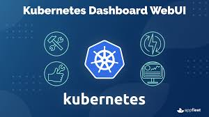
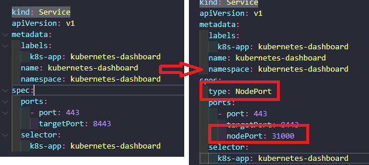
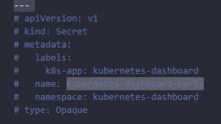
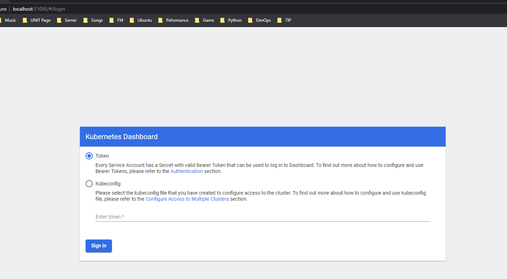

# Chap 4: Kubernetes Dashboard

    

   * Qua 3 phần trước gõ terminal mệt nghỉ :unamused: & làm mọi thứ quá phức tạp. Các anh dev làm ra các trang web để hỗ trợ user sử dụng dễ dàng hơn & đẹp mắt hơn :wink:. Vậy tại sao lại không có 1 màn hình để quản lý Kubernetes ?
   * Hehe mấy anh google có tặng kèm thêm 1 công cụ trên platform Web để giải quyết vấn đề trên. Cháu nó gọi là **Kubernetes Dashboard**

      

      ## Let's go :hammer:

      ### Thiết lập Dashboard qua địa chỉ IP các Node
        1. Download file cấu hình version 2.2 yaml [link](https://raw.githubusercontent.com/kubernetes/dashboard/v2.2.0/aio/deploy/recommended.yaml).
        2. Tiếp tục tạo folder **dashboard** trong workspace của phần trước.
        3. Đổi tên file yaml để dễ nhớ hơn: dashboard-v2.2.yaml
        4. Tiến hành chỉnh sửa file. Port của Kubernetes Cluster `từ 30000 đến 32767`

       

        5. Xóa Secret có tên kubernetes-dashboard-certs. Đoạn cấu hình này để khởi tạo Secret cấu hình xác thực SSL khi truy cập Dashboard, ta xóa nó đi bằng cách comment như sau:

        

        6. Tạo ra 1 image để đăng ký SSL (Linux ko cần)

                FROM alpine

                RUN apk update && \
                    apk add --no-cache openssl && \
                    rm -rf /var/cache/apk/*

                WORKDIR /

                ENTRYPOINT ["openssl"]

        7.  docker build -t myopenssl -f Dockerfile .
        8.  Chạy bằng PowerShell =>  `docker run --rm -v ${PWD}/certs:/certs/ myopenssl req -nodes -newkey rsa:2048 -keyout /certs/dashboard.key -out /certs/dashboard.csr -subj "/C=/ST=/L=/O=/OU=/CN=kubernetes-dashboard"`
        9.  `docker run --rm -v ${PWD}/certs:/certs/ myopenssl x509 -req -sha256 -days 365 -in /certs/dashboard.csr -signkey /certs/dashboard.key -out /certs/dashboard.crt`
        10. `kubectl create secret generic kubernetes-dashboard-certs --from-file=certs -n kubernetes-dashboard` # add SSL
        11. Truy cập: https://localhost:31000

       

        12. Tạo một file có tên admin-user.yaml

                apiVersion: v1
                kind: ServiceAccount
                metadata:
                name: admin-user
                namespace: kubernetes-dashboard

                ---
                apiVersion: rbac.authorization.k8s.io/v1
                kind: ClusterRoleBinding
                metadata:
                name: admin-user
                roleRef:
                apiGroup: rbac.authorization.k8s.io
                kind: ClusterRole
                name: cluster-admin
                subjects:
                - kind: ServiceAccount
                name: admin-user
                namespace: kubernetes-dashboard

        13. `kubectl apply -f admin-user.yaml`
        14. `kubectl -n kubernetes-dashboard describe secret $(kubectl -n kubernetes-dashboard get secret | grep admin-user | awk '{print $1}')`
        15. Copy toàn bộ đoạn Token để đưa vào đăng nhập

**Bài viết tham khảo:**
  1. https://xuanthulab.net/cai-dat-va-su-dung-kubernetes-dashboard.html
---

      