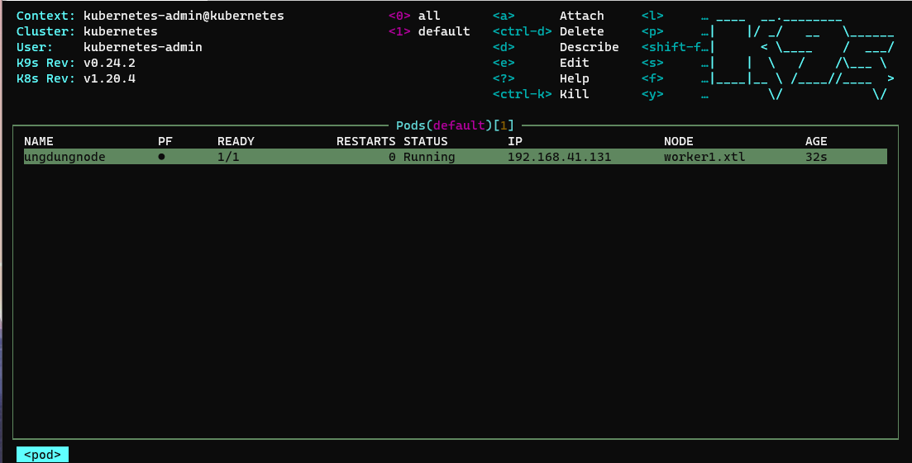

# Chap 5: K9s

  K9S là công cụ CLI để quản lý, tương tác với K8S (Kubernetes) với giao diện dòng lệnh trên Terminal, tuy nhiên vẫn rất trực quan.

   

   ## Cài đặt trên Ubuntu

    # cài snap nếu chưa có (bản Ubutu mới có sẵn)
    sudo apt update
    sudo apt install snapd

    # cài k9s
    sudo snap install k9s

   ## Cài đạt K9S trên Windows

   1. Truy cập vào github [K9s](https://github.com/nProgrammer94/DevOpsLearning/blob/main/documents/3.K8s.md#congratulation-clap-c%C6%B0ng-%C4%91%C3%A3-setup-th%C3%A0nh-c%C3%B4ng-k8s-thumbsup-punch).
   2. Tìm mục **Assets** download bản dành cho windows.
   3. Giải nén & coppy fiile `k9s.exe` vào thư mục `C:\Windows\system32`.

   ## Đọc kỹ hướng dẫn trước khi dùng

   1. Để mở K9s cần mở terminal lên & gõ: `k9s`.
   2. `shif + :` => chọn tài nguyên để thao tác (pod, node, ...)
   3. `ctrl + d` => xóa POD
   4. `d` => describe của POD
   5. `?` => hiện thị bảng lệnh
   6. `ctrl + c` => exit.