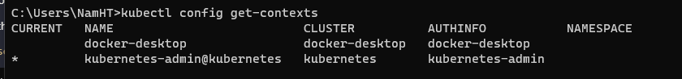
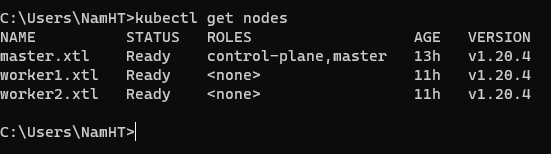
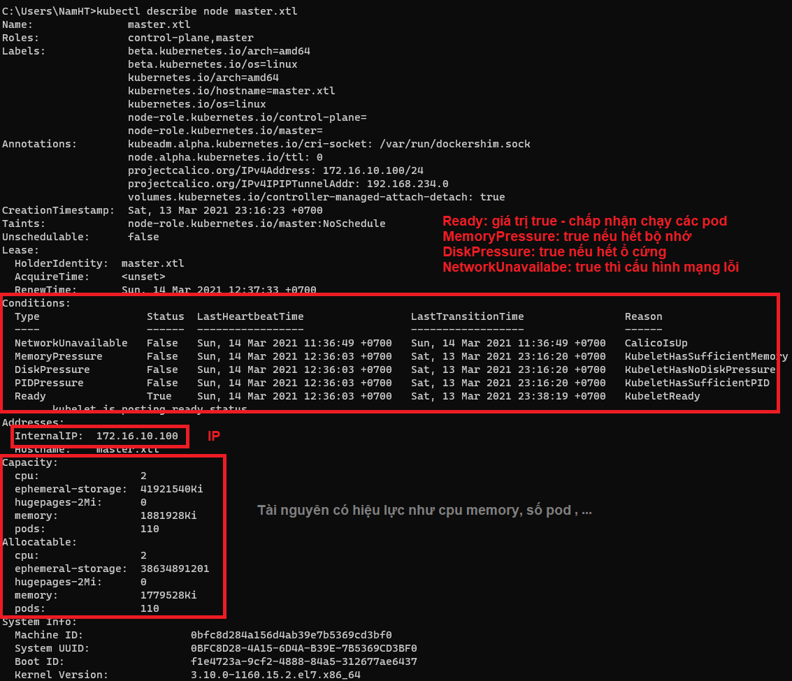
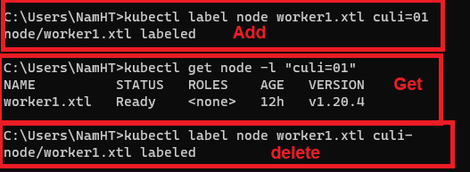

# Chap 5: Pod và Node trong Kubernetes

   ## Nhắc lại bài cũ 1 tẹo :reminder_ribbon:
   Nhắc lại khái niệm của **Pod**: `Pod là một nhóm gồm một hoặc nhiều ứng dụng container, bao gồm lưu trữ được chia sẽ (volumes), địa chi IP & thông tin cách chạy của chúng`.
   

Pods

   

   
 
   

   

   **Node**: `một Node là một máy worker trong Kubernetes. Mỗi Node được quản lí bởi Master. Một Node có thể chứa nhiều Pods`.
   

Node

   

   

   

    

   **kubectl**: `Công cụ quản trị Kubernetes. Cho phép dev đẩy các mô tả triển khai vào cụm Kubernetes & quản lý được cụm Kubernetes`.

   <space><space>
   ## Node

   * Node là đơn vị nhỏ nhất nếu xét về phần cứng (1 node có thể là 1 VM, 1 pc cà tàn hoặc là 1 trong nhiều worker trên 1 pc) trong 1 cụm Cluster.
   * Rồi hen, giờ thì đi check thử coi thông tin node nào đó như tài nguyên bộ nhớ CPU như lào.

        1. Lấy thông các cluster đang có trên máy nha: `kubectl config get-contexts`

            
        2. Ở đây mình sẽ chọn cluster mà mình đã setup như ở [chap 3](https://github.com/nProgrammer94/DevOpsLearning/blob/main/documents/3.K8s.md#congratulation-clap-c%C6%B0ng-%C4%91%C3%A3-setup-th%C3%A0nh-c%C3%B4ng-k8s-thumbsup-punch).
        3. Để chuyển từ **docker-desktop => kubernetes-admin@kubernetes** dùng lệnh: `kubectl config use-context kubernetes-admin@kubernetes`
        4. Sau khi chọn Cluster mặc định, giờ check coi trong cluster này có những nodes gì nhá: `kubectl get nodes`

            
        5. Check tiếp xem 1 node nào đó như resource, cpu, ... : `kubectl describe node <tên-node>`

            

        6. Có thể gán label cho Node để dễ nhớ:
           1. Gán label `kubectl label node <Node name> <label=value>`

                

---
**Bài viết tham khảo:**
  1. https://kubernetes.io/vi/docs/tutorials/kubernetes-basics/explore/explore-intro/#:~:text=M%E1%BB%99t%20Pod%20l%C3%A0%20m%E1%BB%99t%20nh%C3%B3m,tin%20v%E1%BB%81%20c%C3%A1ch%20ch%E1%BA%A1y%20ch%C3%BAng.
---
